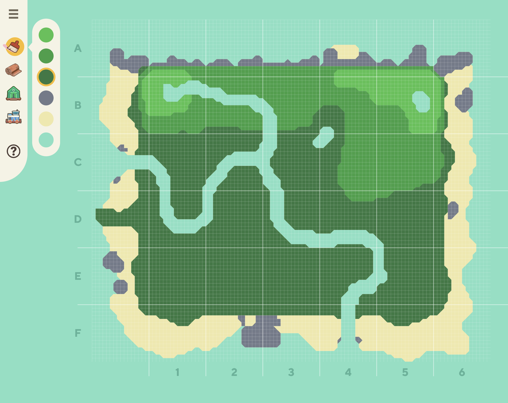

# Happy Island Designer

Create your own at:
https://eugeneration.github.io/HappyIslandDesigner/

Report bugs in the Issues tab or on the [Discord](https://discord.gg/EtaqD5H)

## Features

* autosave
* undo/redo
* zooming
* Choose between flat icons or high quality renders for building icons
* Save an image of a map and load the image back in to recover your map (the map data is encoded in the image)
* Click the tool icon a second time to hide the pop out tool menu
* Brush size selector
* Line toggle buttons
* Mobile - pinch to zoom and two finger swipe to scroll

### Hotkeys

* Hold `SHIFT` to draw straight lines
* Hold `ALT` and click a color to switch to it
* Hold `ALT` and scroll to zoom
* Hold `SPACEBAR` and drag to pan

## Known Issues

**Note that if you edit/compress the saved image, the encoded data will get corrupted.** If you're sharing a map, make sure to use an image host that doesn't compress the image.

The UI isn't really optimal for mobile, but at least it works.

The UI will be cut off if you hold your phone in landscape mode.

## FAQ

### The browser crashes every time I open it!

The autosave file might be corrupted. Open the browser console (hit `F12`) and run this command `editor.clearAutosave()` to remove your autosave file.

## Future Enahancements

* All the icons
* Island name banner
* Text labels
* UI overhaul
* Isometric view??

## Development

Once I saw that you could customize your island in the AC direct, I was inspired to make a tool that lets you make your own island. Several dozen hours of work later, I have this! This is an alpha build, so some things may be wonky, and the maps data may become incompatible with future versions.

Click here for [technical details](/docs/README-technical.md).

Click here for [local development info](/docs/README-localdev.md).
